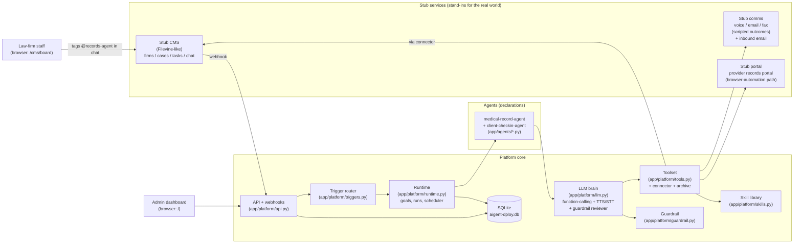
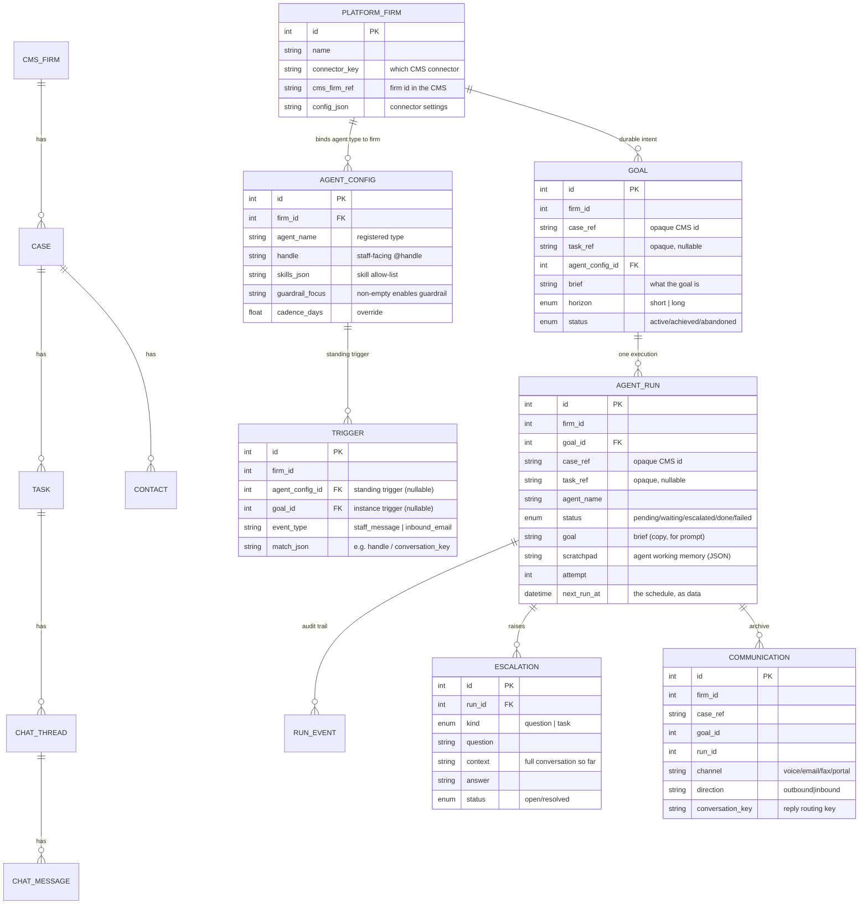
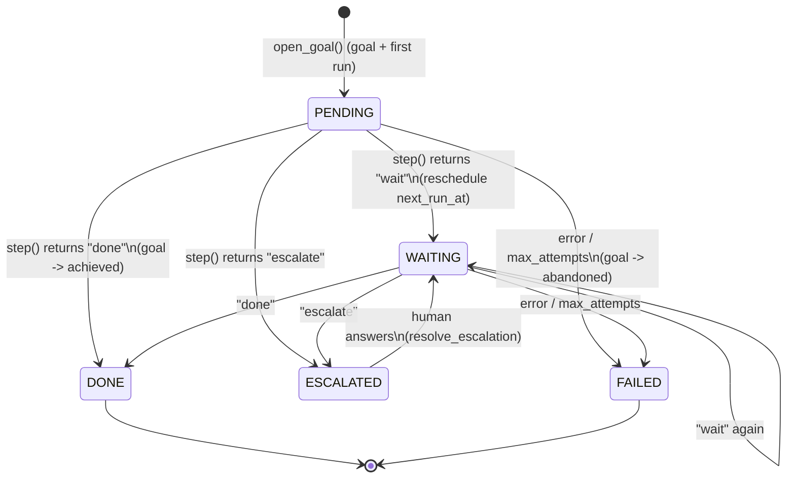
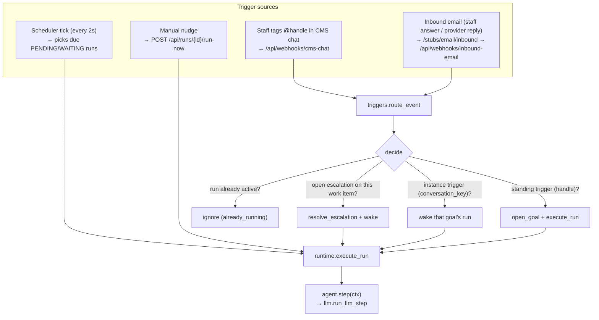
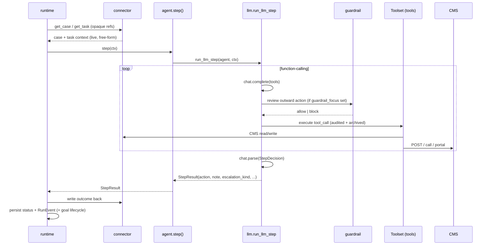
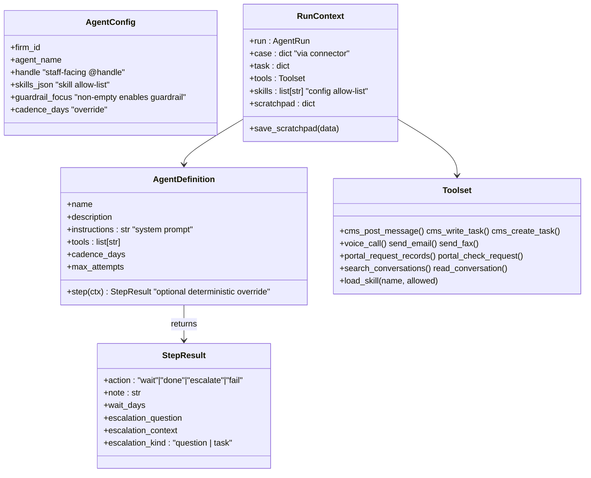
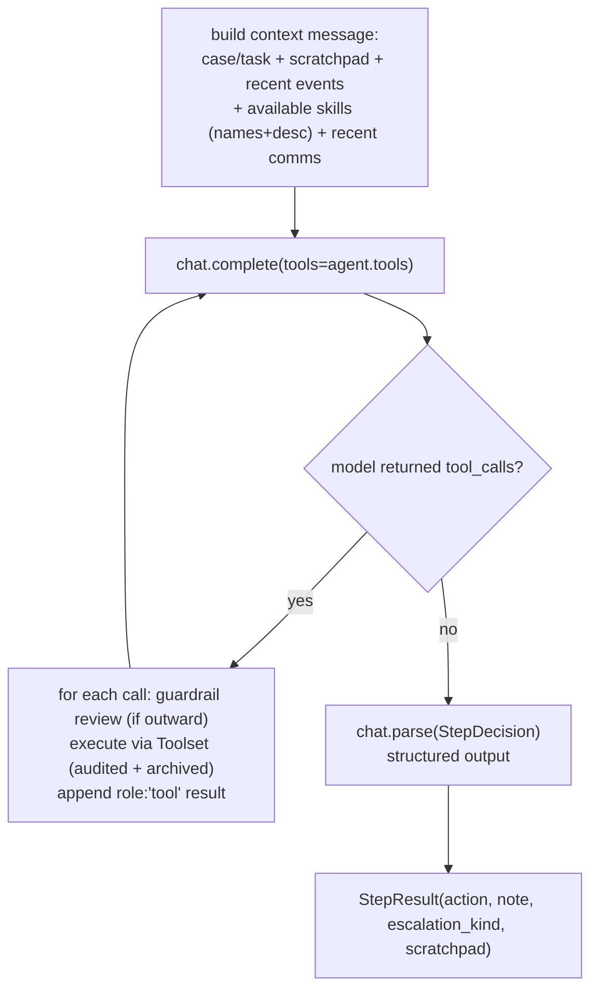
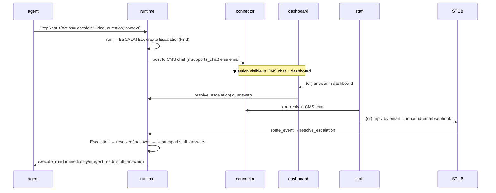

# Aigent-Dploy Agent Platform — Codebase Guide

A walkthrough of how this repository is structured and how the pieces fit
together. The project is a **proof-of-concept** for a platform that makes
building new "workflow agents" cheap. One process runs the whole system end to
end: stub services, the agent platform, and a dashboard.

> For the *why* and the ideal production design, read `BACKGROUND.md` and
> `PLATFORM.md`. This guide focuses on the *code as it exists*.

---

## 1. The big picture

The one idea to hold onto: **the CMS owns the business data, the platform owns
what the agents did, and an agent is just a declaration — a system prompt plus a
tool allow-list.** The platform drives the agent through Mistral
(function-calling + speech), so there is no per-agent scheduling, persistence,
or decision code.

Two structural ideas sit on top of that:

- **Goals are first-class.** A *goal* is durable intent on a case ("get the
  records", "keep the client updated till the case closes"); a *run* is one
  contiguous execution toward it. Triggers bind to goals.
- **Per-firm configuration is data.** Agent *types* live in code; per-firm
  `agent_configs` carry the handle, the skill allow-list, the optional guardrail
  focus, and cadence overrides — so the same agent type behaves (safely)
  differently per firm.



Everything external (CMS, phone, email, fax, portal) is a **stub** that the
platform talks to over HTTP, exactly as it would talk to a real provider.
Swapping a stub for a real integration changes *no platform code* — that's the
whole point. CMS access goes through the firm's **connector** (`connectors.py`),
not direct HTTP.

---

## 2. Directory layout

```
app/
  main.py                  FastAPI app: mounts every router, DB init, scheduler loop
  config.py                Settings (URLs, DB path, scheduler interval, Mistral models, skills root)
  agents/
    definitions.py         re-exports registered agents
    medical_records.py      THE reference agent (instructions + tool allow-list)
    client_checkin.py      case-scoped long-horizon agent (proves multi-agent + skills)
  platform/                <-- the reusable platform
    agent_base.py          Agent contract: StepResult, RunContext, AgentDefinition
    models.py              platform DB: PlatformFirm, AgentConfig, Goal, AgentRun,
                           RunEvent, Escalation, Trigger, Communication
    connectors.py          CMS connector interface + StubCMSConnector (capability flags)
    skills.py              skill library: scan/registry + progressive disclosure
    guardrail.py           adversarial reviewer (optional per config)
    triggers.py            route_event: ONE pipeline for all inbound events
    llm.py                 Mistral: chat, structured decision, TTS/STT, tool-calling loop
    runtime.py             goal/run lifecycle: open_goal, execute_run, escalate, resolve
    tools.py               Toolset: everything an agent can do (audited + archive + speech)
    db.py                  SQLAlchemy engine/session for the platform DB
    api.py                 /api/* : webhooks, goals, runs, escalations, memory, configs
    dashboard.py           / and /runs/{id} admin HTML views
  stubs/                   <-- stand-ins for external systems
    cms_models.py          stub CMS data model (Firm, Case, Task, Contact, chat)
    cms_api.py             stub CMS REST API + task-board UI
    comms_api.py           voice / email / fax (scripted) + inbound-email endpoint
    portal_api.py          provider records portal (scripted releases)
skills/                    <-- skill library (Markdown knowledge, not code)
  metro-general-portal/SKILL.md
  stub-cms-basics/SKILL.md
  trauma-records-request/SKILL.md
  firms/doe-and-associates/org-chart/SKILL.md
scripts/
  seed.py                  seeds firm, platform_firm, 2 agent_configs, 2 triggers, stub scenarios
  mistral_smoke.py         sanity-checks chat / structured output / TTS / STT
```

**Two SQLAlchemy bases, one database file.** `Base` (platform) and `CmsBase`
(stub CMS) both map into `aigent-dploy.db`, plus three raw-SQLite tables
(`stub_log`, `stub_scenarios`, `portal_requests`) created by `STUB_DDL` in
`app/main.py`. The stub comms/portal code talks to those raw tables with
`sqlite3`, not ORM.

---

## 3. Data model

The split between "system of record" and "what the agent did" is the most
important design decision. Two models, owned by different layers:



Key points:

- `case_ref`/`task_ref` are **opaque strings the platform doesn't own** — the
  platform stores them and fetches the actual context from the CMS at run time
  (through the firm's connector). Business context (case facts, contacts, chat)
  lives only in the stub CMS tables; outcomes get written back there.
- `agent_runs.goal` is the brief *text* (a copy for the prompt); the
  relationship to the `Goal` row is `goal_row`. Don't rename one to the other.
- `communications` is a **derivative context store**, not a system of record —
  a private, firm-tagged copy of the calls/emails/faxes the agent made or
  received. Outcomes still get written back to the CMS; this exists as agent
  memory (too verbose for the CMS, valuable for recall).

The `scratchpad` column is the agent's cross-invocation working memory: a JSON
blob. For the records agent it holds the `portal_request_id` and any
`staff_answers` to escalations. The LLM decides what goes in it via the
`scratchpad` field of its structured `StepDecision`; the platform merges that
back into the run.

---

## 4. The goal / run lifecycle

A **goal** is durable intent on a case; a **run** is one contiguous execution
toward it. A run is *not* a process or thread; it's a row that wakes up, does
one unit of work, and reschedules itself. Follow-up cadence is data
(`next_run_at`), never a sleeping thread.



The `status` values map to `RunStatus` in `app/platform/models.py`. Notice
there is no "running" state — a wake is atomic and synchronous. The only
long-lived states are `WAITING` (next wake scheduled) and `ESCALATED` (parked
on a human). Each wake runs the LLM loop to completion (or to a `MistralError`,
which lands the run in `FAILED` and the goal in `ABANDONED`). A goal survives a
failed run — staff can open a new run under the same goal.

---

## 5. Who wakes a run (triggers)

Triggers are **data, not code paths**. One routing pipeline handles every
inbound event.



Four things can wake a run, all funneling into `execute_run`:

1. **CMS chat webhook** (`/api/webhooks/cms-chat`) — the stub CMS fires it
   whenever a *staff* message is posted. Routed through `route_event` in
   `triggers.py`, in this order: open escalation on the work item → instance
   trigger (`conversation_key`) → already-running run → standing trigger (agent
   `@handle`) opens a new goal. This replaces the old hardcoded
   `agent_name="medical-record-agent"`.
2. **Inbound email** (`/stubs/email/inbound` → `/api/webhooks/inbound-email`) —
   a staff answer by email or a provider reply, matched by `conversation_key`
   (minted by the Toolset on outbound comms).
3. **Scheduler** (`scheduler_tick` in `runtime.py`) — a background loop in the
   app lifespan (see `main.py`) that runs every 2 seconds and executes any run
   whose `next_run_at` is due.
4. **Manual nudge** (`run_now`) — a demo fast-forward used by the dashboard's
   "run now" button.

**Guard against double-execution:** the webhook executes a new run
synchronously *and* the scheduler may pick it up in the same tick. An
in-process `_executing` set in `runtime.py` ensures a run executes from only
one caller at a time.

---

## 6. What happens inside `execute_run`



The runtime's contract with an agent is tiny — `agent.step(ctx)` returns a
`StepResult` with one of four actions. For LLM agents that `StepResult` comes
from Mistral's structured output (`llm.decide`); the runtime doesn't care
which, it just maps the action:

| `action`   | runtime does                                                        |
|------------|---------------------------------------------------------------------|
| `wait`     | status → `WAITING`, `next_run_at = now + wait_days`                 |
| `done`     | status → `DONE` + goal → `ACHIEVED`, writes `[agent] note` back     |
| `escalate` | status → `ESCALATED`, creates `Escalation`, posts to staff channel  |
| `fail`     | status → `FAILED` + goal → `ABANDONED` (also auto-fails past max) |

Everything the agent did (tool calls, decisions, guardrail verdicts, skill
loads) is written to `run_events` as it happens — the audit trail. This is the
whole runtime; there is no scheduler table, no queue, no worker pool.

---

## 7. The agent contract (how to add one)

An agent is a single module that declares **name, description, instructions
(system prompt), allowed tools, and cadence**. Per-firm configuration (handle,
skills, guardrail, cadence override) lives in the `agent_configs` table.
Scheduling, persistence, audit, the LLM loop, and escalation plumbing live in
the platform.



When `step_fn` is absent, `AgentDefinition.step()` dispatches to
`run_llm_step` in `app/platform/llm.py`, which runs the Mistral
function-calling loop:



The decision rules for the reference agent are expressed as **instructions**
in `medical_records.py`, not as code: submit the portal request once (track it
in the scratchpad), check the portal, call the provider if it's not released,
escalate on `needs_payment`/`refused`/uncertainty, acknowledge a staff answer,
and write every outcome back to the CMS chat.

The scratchpad is the agent's cross-invocation memory, managed *by the model*:
the `StepDecision` can carry a `scratchpad` dict that the platform merges back
into the run (e.g. remembering the `portal_request_id`).

**To add an agent**, write `app/agents/your_agent.py` declaring
`AgentDefinition(name=..., description=..., tools=[...], instructions="...")`,
register it via `register(...)`, and import it in `app/agents/definitions.py`.
Then create an `agent_configs` row per firm (handle, skills, guardrail focus).
Nothing else.

---

## 8. Human-in-the-loop (escalation)

Escalation is a first-class outcome, not an error, and it comes in two kinds:



When an agent escalates, the runtime parks the run and posts the question where
the firm's staff work — the CMS task chat if the connector supports chat,
otherwise by email — and always on the admin dashboard. The `kind` is either
`question` (resolution = an answer) or `task` (a human must go do work;
resolution = a completion note). A staff answer or completion note from **any** of
those places — CMS chat, dashboard, or a plain email reply — is routed back
through the trigger pipeline (`route_event`), recorded on the run, and wakes
the agent, which folds it into its context and continues.

---

## 9. Tools, the guardrail, and the audit trail

Agents never touch the world directly. `Toolset` (`tools.py`) is the only
gateway, constructed per run so `firm_id`/`case_ref`/`task_ref` are injected
automatically (firm scoping + audit, no tool path that bypasses it).

- Each CMS tool goes through the firm's **connector** (resolved from
  `platform_firms.connector_key`); comms/portal tools are thin `httpx` calls to
  the stub URLs (`config.py` holds the URLs).
- `voice_call` is a real speech round-trip: it synthesizes the agent's line
  (TTS), gets the stub's scripted reply, synthesizes *that* in the other party's
  voice (TTS), and transcribes it back (STT).
- Each outbound comms call writes a `RunEvent` (`tool_call`) AND a
  `Communication` row (the archive), and mints a `conversation_key` with an
  instance trigger so inbound replies route back.
- New memory tools: `search_conversations` / `read_conversation` over the
  archive, and `load_skill` (progressive disclosure). All firm-scoped by
  construction.
- The LLM never sees firm/case refs, credentials, or stub-internal keys: tool
  schemas in `llm.py::TOOL_SPECS` expose only domain args, and the dispatcher
  injects the rest.

**The guardrail** (`guardrail.py`): if the firm's `agent_config.guardrail_focus`
is non-empty, every outward/mutating tool call is reviewed by an adversarial
LLM call (same model, adversarial prompt + focus + the same context the agent
saw + the tool's argument schema) *before* it executes. The verdict is `allow`
or `block`; a block feeds back into the agent loop as the tool result
(`{"blocked": true, "reason": ...}`) so the agent can revise or escalate. The
guardrail *constrains* judgment, never replaces it. Verdicts land in the audit
trail (`kind="guardrail"`). It **fails open** on a reviewer outage (audited as
`guardrail UNAVAILABLE ... executed unreviewed`) so a Mistral 429 never stalls
a run; the chat loop also retries on 429 with backoff.

**Known limitation:** the reviewer sees the snapshot context + proposed action
but NOT other in-step tool results, so it can contradict a status the agent just
learned. Mitigations: the reviewer is told to take terminal tool statuses at
face value and respect staff answers/chronology; agent instruction #9 tells it
to escalate rather than resubmit when the same action is blocked twice for the
same reason.

The stub comms also log every call to the raw `stub_log` table, inspectable
via `/api/stub-log`.

---

## 10. Request flow across the process

All routers are mounted on one FastAPI app (`main.py`):

| Prefix             | Module                      | Purpose                                   |
|--------------------|-----------------------------|-------------------------------------------|
| `/api/*`           | `platform/api.py`           | webhooks, goals, runs, escalations, memory, configs, triggers |
| `/` , `/runs/{id}` | `platform/dashboard.py`     | admin HTML dashboard                      |
| `/cms/*`           | `stubs/cms_api.py`          | stub CMS API + `/cms/board` task board    |
| `/stubs/voice` …   | `stubs/comms_api.py`        | voice/email/fax stubs + `/stubs/email/inbound` |
| `/stubs/portal/*`  | `stubs/portal_api.py`       | provider records portal stub              |

Note `main.py` also defines tiny `/ui/...` form handlers so the HTML pages
work without JavaScript — including `/ui/simulate-inbound-email` (the demo
affordance for the outside-world email path).

---

## 11. Running it

```bash
export MISTRAL_API_KEY=...           # required: drives the LLM agent, guardrail, and voice TTS/STT
uv run uvicorn app.main:app --host 127.0.0.1 --port 8000
uv run python scripts/seed.py        # idempotent; seeds firm + platform_firm + 2 agent_configs + 2 triggers + skills + scenarios
uv run python scripts/mistral_smoke.py   # sanity-check chat / structured output / TTS / STT
```

Then open `/` (dashboard) and `/cms/board` (CMS task board). Tag
`@records-agent` in a task chat. The seeded platform setup:

- **`@records-agent`** (config #1): guardrail on (catches overclaims, wrong
  recipients, invented facts), 4 skills attached (`metro-general-portal`,
  `stub-cms-basics`, `trauma-records-request`, firm org-chart).
- **`@checkin-agent`** (config #2): guardrail on (client-facing, never promise
  settlements), org-chart + cms-basics skills, 14-day cadence.

The three demo tasks:

- **Task 1 — Metro General Hospital** → load portal skill → portal request →
  phone follow-up → records released → task closed (happy path).
- **Task 2 — County Records Bureau** → demands prepayment → agent escalates
  (kind=task) → answer in the dashboard, the CMS chat, or via the "simulate
  inbound email" form → agent resumes.
- **Task 3 — Client wellness check-in** → tag `@checkin-agent` → case-scoped
  long-horizon goal (no single task; runs every 14 days) → loads org-chart
  skill → calls the client → creates a staff task for a concern.

There are no tests; verification is `mistral_smoke.py` plus this scripted
end-to-end demo. The LLM is non-deterministic: the agent may take a different
(still valid) path through the tools, so check the final goal/run status rather
than the exact event sequence.

---

## 12. Gotchas worth remembering

- **Mistral SDK is blocking** — never call it on the event loop. It's already
  off-loop (scheduler via `asyncio.to_thread`, webhook/API handlers are sync
  `def`), and `llm.py` raises `MistralError` on failure instead of hanging.
- **Mistral import surface** (v2.x): `from mistralai.client import Mistral`
  (not `from mistralai import Mistral`); structured output is
  `client.chat.parse(response_format=PydanticModel)` → `resp.choices[0].message.parsed`;
  TTS `client.audio.speech.complete(...)` returns base64 `audio_data`; STT
  `client.audio.transcriptions.complete(model=..., file=File(...))`.
- **Never block the event loop.** `scheduler_tick` makes blocking HTTP + DB
  calls; it must run via `asyncio.to_thread` (see `main.py`), or the
  same-process HTTP calls time out.
- **429 rate limits** (free-tier Mistral, doubled by the guardrail's extra
  call): the tool loop retries chat with exponential backoff; the guardrail
  fails open (audited). A 429 is an audited event, not necessarily a dead run.
- **Starlette 1.6** removed `TemplateResponse(name, ctx)` — always
  `templates.TemplateResponse(request, "name.html", {...})`.
- **Webhook + scheduler race** — the `_executing` guard in `runtime.py` is load
  -bearing; keep it if you refactor.
- **`pkill -f uvicorn` kills compound commands**; kill and start servers in
  separate tool calls, and use `(nohup ... &)` for background servers.
- **ORM collision**: `AgentRun.goal` is the brief *text*; `goal_row` is the
  relationship to the `Goal` row. Don't rename one to the other.
- **Opaque refs, not ints**: `case_ref`/`task_ref` are strings; `task_ref` can
  be NULL. Don't cast them to int.
- **No `curl` in this env** — use `uv run python -c "import httpx; ..."` for
  HTTP checks.

---

## 13. Reading order (suggested)

1. `BACKGROUND.md` — domain context and the demo paths.
2. `app/platform/models.py` — the state model (goals, runs, triggers, comms).
3. `app/platform/triggers.py` — the one routing pipeline.
4. `app/platform/agent_base.py` — the agent contract (small).
5. `app/agents/medical_records.py` — the reference agent's instructions + tools.
6. `app/platform/llm.py` — the Mistral function-calling loop + guardrail hook + speech.
7. `app/platform/guardrail.py` — the adversarial reviewer.
8. `app/platform/runtime.py` — how a goal opens and a run wakes, steps, reschedules.
9. `app/platform/connectors.py` + `skills.py` — the CMS seam and the skill library.
10. `app/platform/tools.py` — the tool gateway + archive + speech round-trip.
11. `app/platform/api.py` — triggers (webhooks) and escalation resolution.
12. `app/stubs/*` — what the platform is talking to.
13. `scripts/seed.py` — the scripted demo end to end.
