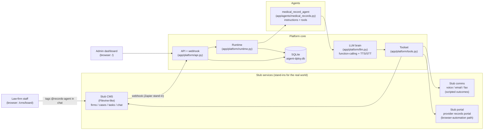
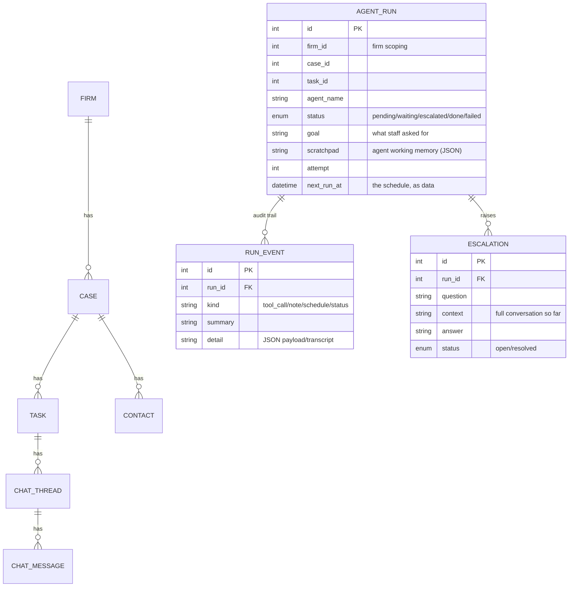
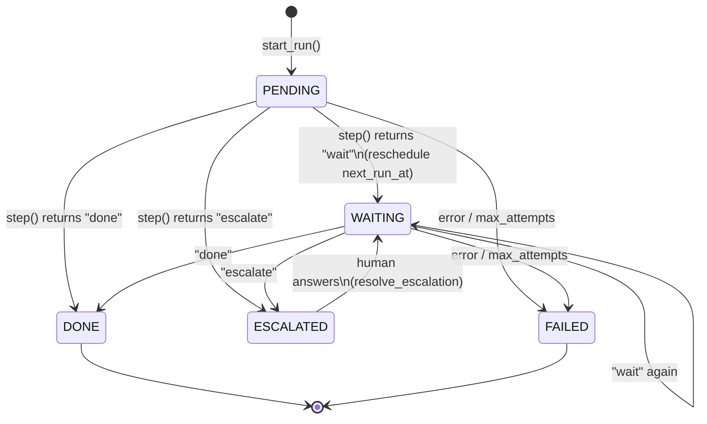
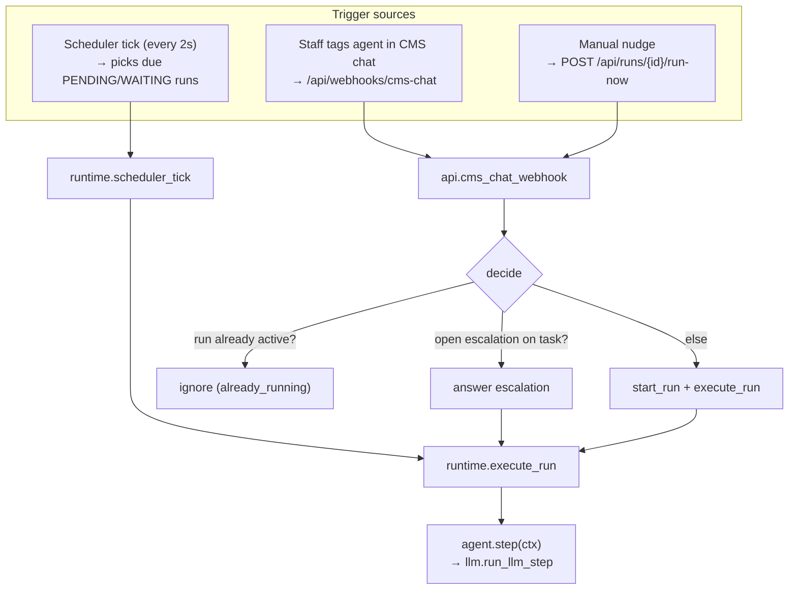
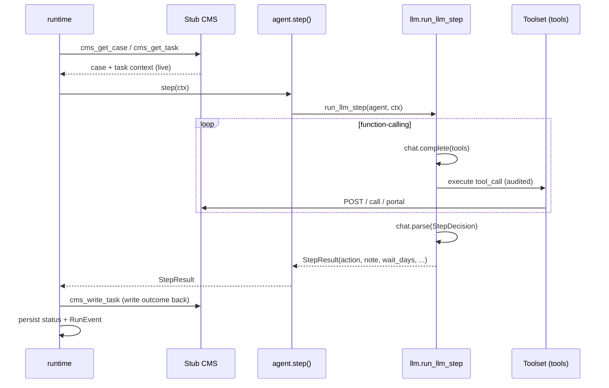
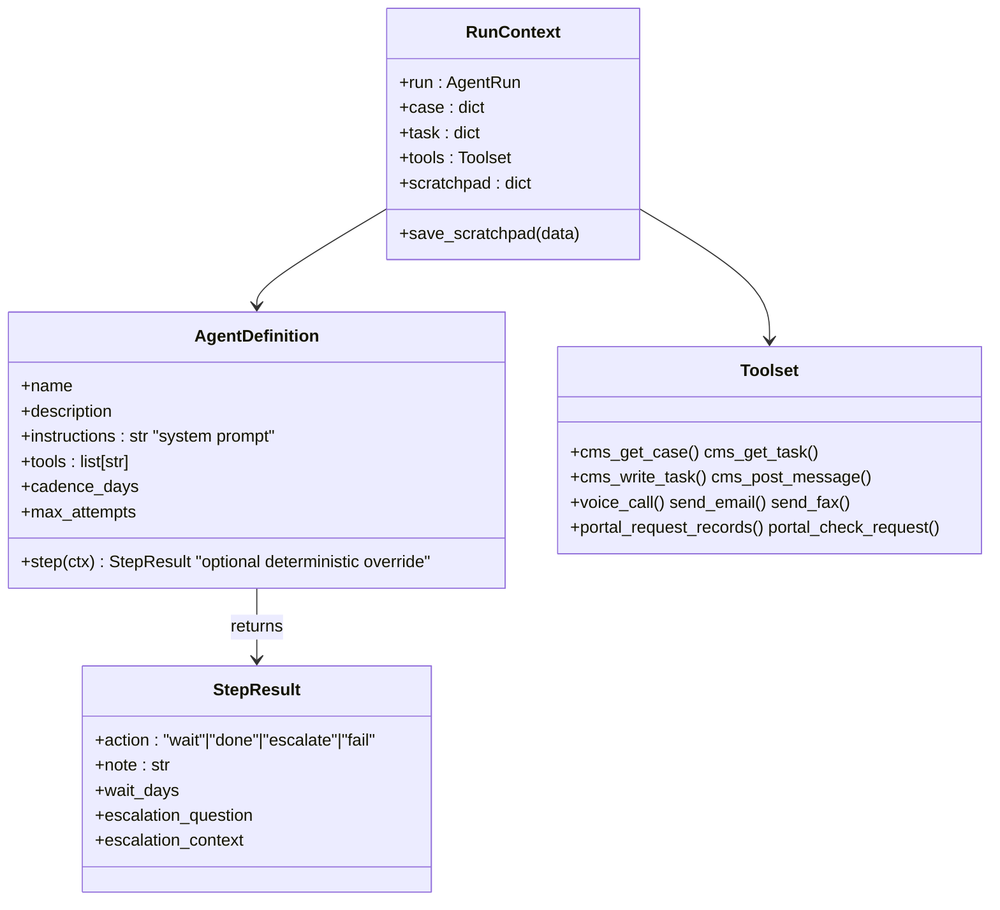
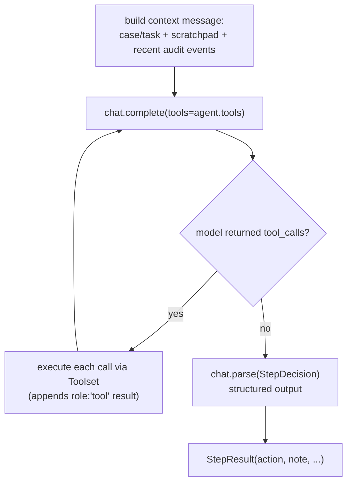
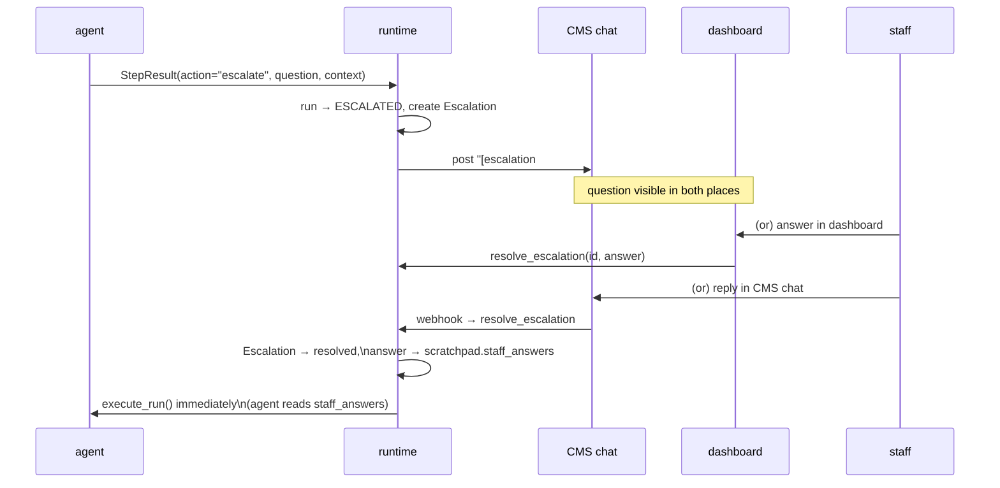

# Aigent-Dploy Agent Platform — Codebase Guide

A walkthrough of how this repository is structured and how the pieces fit
together. The project is a **proof-of-concept** for a platform that makes
building new "workflow agents" cheap. One process runs the whole system end to
end: stub services, the agent platform, and a dashboard.

> For the *why* and the ideal production design, read `BACKGROUND.md` and
> `PLATFORM.md`. This guide focuses on the *code as it exists*.

---

## 1. The big picture

The one idea to hold onto: **the CMS owns the business data, the platform owns
what the agents did, and an agent is just a declaration — a system prompt plus
a tool allow-list.** The platform drives the agent through Mistral
(function-calling + speech), so there is no per-agent scheduling, persistence,
or decision code.



Everything external (CMS, phone, email, fax, portal) is a **stub** that the
platform talks to over HTTP, exactly as it would talk to a real provider.
Swapping a stub for a real integration changes *no platform code* — that's the
whole point.

---

## 2. Directory layout

```
app/
  main.py                  FastAPI app: mounts every router, DB init, scheduler loop
  config.py                Settings (URLs, DB path, scheduler interval, Mistral models)
  agents/
    definitions.py         re-exports registered agents
    medical_records.py     THE reference agent (instructions + tool allow-list)
  platform/                <-- the reusable platform
    agent_base.py          Agent contract: StepResult, RunContext, AgentDefinition
    llm.py                 Mistral: chat, structured decision, TTS/STT, tool-calling loop
    runtime.py             run lifecycle: start, execute, escalate, resolve, scheduler
    tools.py               Toolset: everything an agent can do (audited + speech round-trip)
    models.py              platform DB: AgentRun, RunEvent, Escalation
    db.py                  SQLAlchemy engine/session for the platform DB
    api.py                 /api/* : webhook, runs, escalations
    dashboard.py           /  and /runs/{id}  admin HTML views
  stubs/                   <-- stand-ins for external systems
    cms_models.py          stub CMS data model (Firm, Case, Task, Contact, chat)
    cms_api.py             stub CMS REST API + task-board UI
    comms_api.py           voice / email / fax (scripted scenarios; voice = real TTS/STT)
    portal_api.py          provider records portal (scripted releases)
scripts/
  seed.py                  seeds one firm/case/tasks + scripted stub behaviour
  mistral_smoke.py         sanity-checks chat / structured output / TTS / STT
```

**Two SQLAlchemy bases, one database file.** `Base` (platform) and `CmsBase`
(stub CMS) both map into `aigent-dploy.db`, plus three raw-SQLite tables
(`stub_log`, `stub_scenarios`, `portal_requests`) created by `STUB_DDL` in
`app/main.py`. The stub comms/portal code talks to those raw tables with
`sqlite3`, not ORM.

---

## 3. Data model

The split between "system of record" and "what the agent did" is the most
important design decision. Two models, owned by different layers:



Key point: `firm_id`, `case_id`, `task_id` are **foreign keys the platform
doesn't own** — the platform stores the IDs and fetches the actual context
from the CMS at run time. Business context (case facts, contacts, chat) lives
only in the stub CMS tables; outcomes get written back there.

The `scratchpad` column is the agent's *only* cross-invocation memory: a JSON
blob. For the records agent it holds the `portal_request_id` and any
`staff_answers` to escalations. The LLM decides what goes in it via the
`scratchpad` field of its structured `StepDecision`; the platform merges that
back into the run.

---

## 4. The run lifecycle (state machine)

A **run** = one agent assigned to one task within one case. It is *not* a
process or thread; it's a row that wakes up, does one unit of work, and
reschedules itself. Follow-up cadence is data (`next_run_at`), never a
sleeping thread.



The `status` values map to `RunStatus` in `app/platform/models.py`. Notice
there is no "running" state — a wake is atomic and synchronous. The only
long-lived states are `WAITING` (next wake scheduled) and `ESCALATED` (parked
on a human). Each wake runs the LLM loop to completion (or to a `MistralError`,
which lands the run in `FAILED`).

---

## 5. Who wakes a run (triggers)



Three things can wake a run, all funneling into `execute_run`:

1. **CMS chat webhook** (`cms_chat_webhook` in `api.py`) — the primary path.
   The stub CMS fires it whenever a *staff* message is posted. The platform
   then decides, in this order (see `api.py:32`): open escalation → treat as
   the answer; run already active → ignore; otherwise → start a new run.
2. **Scheduler** (`scheduler_tick` in `runtime.py`) — a background loop in the
   app lifespan (see `main.py:68`) that runs every 2 seconds and executes any
   run whose `next_run_at` is due.
3. **Manual nudge** (`run_now`) — a demo fast-forward used by the dashboard's
   "run now" button.

**Guard against double-execution:** the webhook executes the new run
synchronously *and* the scheduler may pick it up in the same tick. An
in-process `_executing` set in `runtime.py:31` ensures a run executes from only
one caller at a time.

---

## 6. What happens inside `execute_run`



The runtime's contract with an agent is tiny — `agent.step(ctx)` returns a
`StepResult` with one of four actions. For LLM agents that `StepResult` comes
from Mistral's structured output (`llm.decide`); the runtime doesn't care
which, it just maps the action:

| `action`   | runtime does                                                        |
|------------|---------------------------------------------------------------------|
| `wait`     | status → `WAITING`, `next_run_at = now + wait_days`                  |
| `done`     | status → `DONE`, writes `[agent] note` back to the CMS task          |
| `escalate` | status → `ESCALATED`, creates `Escalation`, posts to CMS chat        |
| `fail`     | status → `FAILED` (also auto-fails past `max_attempts`)              |

Everything the agent did (tool calls, decisions) is written to `run_events` as
it happens — the audit trail. This is the whole runtime; there is no scheduler
table, no queue, no worker pool. (`runtime.py` is only ~175 lines.)

---

## 7. The agent contract (how to add one)

An agent is a single module that declares **name, description, instructions
(system prompt), allowed tools, and cadence**. That's all — scheduling,
persistence, audit, the LLM loop, and escalation plumbing live in the
platform.



When `step_fn` is absent, `AgentDefinition.step()` dispatches to
`run_llm_step` in `app/platform/llm.py`, which runs the Mistral
function-calling loop:



The decision rules for the reference agent are expressed as **instructions**
in `medical_records.py`, not as code: submit the portal request once (track it
in the scratchpad), check the portal, call the provider if it's not released,
escalate on `needs_payment`/`refused`/uncertainty, acknowledge a staff answer,
and write every outcome back to the CMS chat.

The scratchpad is the agent's cross-invocation memory, now managed *by the
model*: the `StepDecision` can carry a `scratchpad` dict that the platform
merges back into the run (e.g. remembering the `portal_request_id`).

**To add an agent**, write `app/agents/your_agent.py` declaring
`AgentDefinition(name=..., description=..., tools=[...], instructions="...")`,
register it via `register(...)`, and import it in `app/agents/definitions.py`.
Nothing else.

---

## 8. Human-in-the-loop (escalation)

Escalation is a first-class outcome, not an error:



When an agent escalates, the runtime parks the run and posts the question into
the CMS task chat (where staff already work) *and* surfaces it on the admin
dashboard. A staff answer from **either** place calls `resolve_escalation`,
which:

1. marks the escalation resolved,
2. appends the answer to the run's `scratchpad.staff_answers`,
3. wakes the run immediately (`next_run_at = now`).

On its next invocation, the agent reads `staff_answers` from the scratchpad and
folds the answer into its work (the reference agent's instructions tell it to
acknowledge a staff answer then continue).

The `cms_chat_webhook` ordering matters here: an open escalation is answered
*before* checking for an existing run — otherwise a staff reply would be
mistaken for "start a new run."

---

## 9. Tools & the audit trail

Agents never touch the world directly. `Toolset` (`tools.py`) is the only
gateway, constructed per run so `firm_id`/`case_id`/`task_id` are injected
automatically (firm scoping + audit, no tool path that bypasses it).

- Each tool is a thin `httpx` call to a stub URL (`config.py` holds the URLs).
- `voice_call` is a real speech round-trip: it synthesizes the agent's line
  (TTS), gets the stub's scripted reply, synthesizes *that* in the other
  party's voice, and transcribes it back (STT) — the transcript the agent
  reasons over is genuinely spoken and heard, not a script. Audio byte counts
  land in the audit detail.
- Each call writes a `RunEvent` row (`tool_call` kind) with the summary and
  JSON detail — the audit trail.
- Tool **payloads are deliberately free-form** (the CMS changes between
  firms); only the envelope (outcome / transcript / payload) is normalized.
  Agents read, they don't assume a schema.
- The LLM never sees firm/case/task ids, credentials, or stub-internal keys:
  tool schemas in `llm.py::TOOL_SPECS` expose only domain args, and the
  dispatcher injects the rest (e.g. deriving the provider's `provider_key`
  from its name).

The stub comms also log every call to the raw `stub_log` table, inspectable
via `/api/stub-log`.

---

## 10. Request flow across the process

All six routers are mounted on one FastAPI app (`main.py`):

| Prefix             | Module                      | Purpose                                   |
|--------------------|-----------------------------|-------------------------------------------|
| `/api/*`           | `platform/api.py`           | webhook, runs, escalations                |
| `/` , `/runs/{id}` | `platform/dashboard.py`     | admin HTML dashboard                      |
| `/cms/*`           | `stubs/cms_api.py`          | stub CMS API + `/cms/board` task board    |
| `/stubs/voice` …   | `stubs/comms_api.py`        | voice/email/fax stubs                     |
| `/stubs/portal/*`  | `stubs/portal_api.py`       | provider records portal stub              |

Note `main.py:101-125` also defines tiny `/ui/...` form handlers so the HTML
pages work without JavaScript — these just re-POST to the real endpoints via
`httpx`.

---

## 11. Running it

```bash
export MISTRAL_API_KEY=...           # required: drives the LLM agent + voice TTS/STT
uv run uvicorn app.main:app --host 127.0.0.1 --port 8000
uv run python scripts/seed.py        # idempotent; seeds one firm/case/2 tasks + scenarios
uv run python scripts/mistral_smoke.py   # sanity-check chat / structured output / TTS / STT
```

Then open `/` (dashboard) and `/cms/board` (CMS task board). Tag
`@records-agent` in task 1's chat (happy path) or task 2's chat (escalation
path). The two seeded scenarios:

- **Metro General Hospital** → portal request → phone follow-up → records
  released → task closed (happy path).
- **County Records Bureau** → demands prepayment → agent escalates → staff
  answers in the chat or dashboard → agent resumes.

There are no tests; verification is `mistral_smoke.py` plus this scripted
end-to-end demo. The LLM is non-deterministic: the agent may take a different
(still valid) path through the tools, so check the final status rather than
the exact event sequence.

---

## 12. Gotchas worth remembering

- **Mistral SDK is blocking** — never call it on the event loop. It's already
  off-loop (scheduler via `asyncio.to_thread`, webhook/API handlers are sync
  `def`), and `llm.py` raises `MistralError` on failure instead of hanging.
- **Mistral import surface** (v2.x): `from mistralai.client import Mistral`
  (not `from mistralai import Mistral`); structured output is
  `client.chat.parse(response_format=PydanticModel)` → `resp.choices[0].message.parsed`;
  TTS `client.audio.speech.complete(...)` returns base64 `audio_data`; STT
  `client.audio.transcriptions.complete(model=..., file=File(...))`.
- **Never block the event loop.** `scheduler_tick` makes blocking HTTP + DB
  calls; it must run via `asyncio.to_thread` (see `main.py:73`), or the
  same-process HTTP calls time out.
- **Starlette 1.6** removed `TemplateResponse(name, ctx)` — always
  `templates.TemplateResponse(request, "name.html", {...})`.
- **Webhook + scheduler race** — the `_executing` guard in `runtime.py` is load
  -bearing; keep it if you refactor.
- **`pkill -f uvicorn` kills compound commands**; kill and start servers in
  separate tool calls, and use `(nohup ... &)` for background servers.
- **No `curl` in this env** — use `uv run python -c "import httpx; ..."` for
  HTTP checks.
- **Escalation answers**: the CMS stub forwards *every* staff message; the
  platform (not the stub) decides ordering — answer open escalation > already
  running > start new run.

---

## 13. Reading order (suggested)

1. `BACKGROUND.md` — domain context and the two demo paths.
2. `app/platform/models.py` — the state model (runs, events, escalations).
3. `app/platform/agent_base.py` — the agent contract (small).
4. `app/agents/medical_records.py` — the reference agent's instructions + tools.
5. `app/platform/llm.py` — the Mistral function-calling loop + speech.
6. `app/platform/runtime.py` — how a run wakes, steps, and reschedules.
7. `app/platform/api.py` — triggers and escalation resolution.
8. `app/platform/tools.py` — the tool gateway + audit trail + speech round-trip.
9. `app/stubs/*` — what the platform is talking to.
10. `scripts/seed.py` — the scripted demo end to end.
