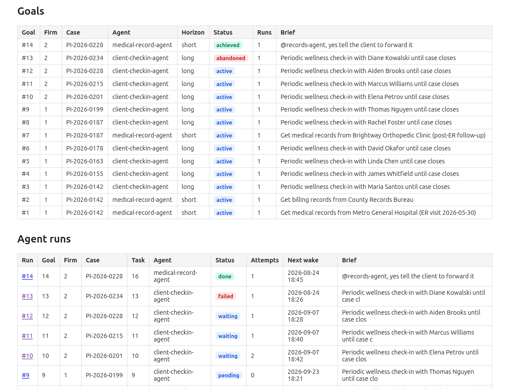
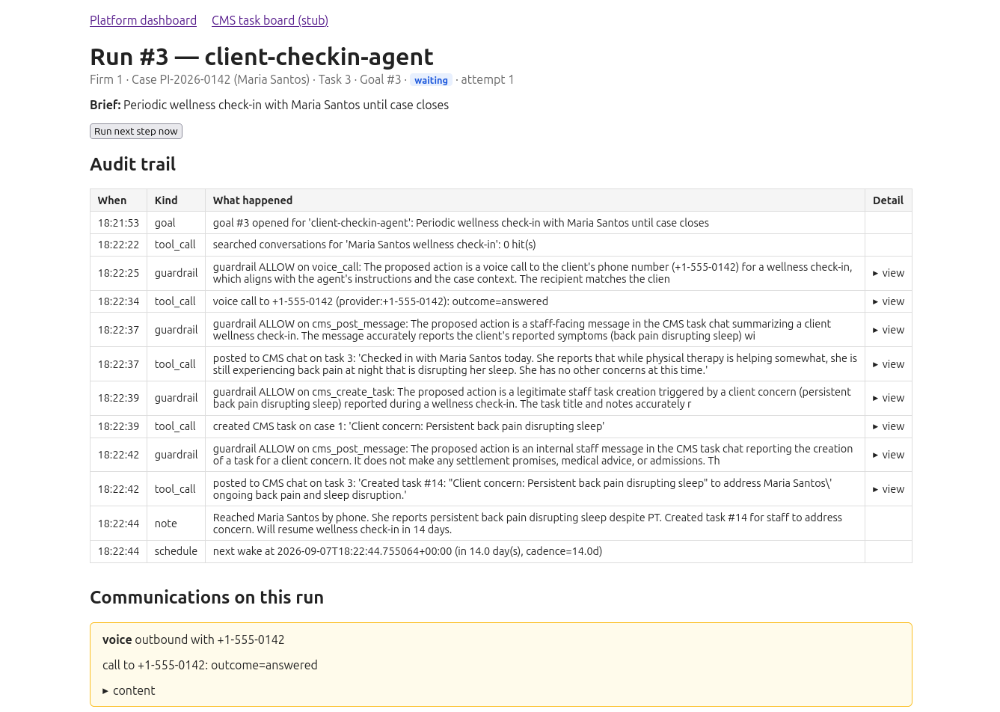

# Long Running Agent Platform : Aigent-Dploy

Aigent-Dploy is a local proof-of-concept for a platform that helps deploy AI agents for law firms.

## Quick start

```bash
export MISTRAL_API_KEY=...                     # required for the LLM agent + voice TTS/STT. skip if just looking at web app
uv run python scripts/seed.py
uv run uvicorn app.main:app --host 127.0.0.1 --port 8000
```

Then open `/` (dashboard) and `/cms/board` (stub CMS task board), and tag `@records-agent` in a task chat to start a run.

## Documentation

* [`BACKGROUND.md`](BACKGROUND.md) — real-world PI-firm context and the workflows the agents automate.
* [`PLATFORM.md`](PLATFORM.md) — ideal-state platform design.
* [`GUIDE.md`](GUIDE.md) — current implementation, full run-through, and gotchas.

## Sample
Screenshot of home page:


Screenshot of a particular goal:
